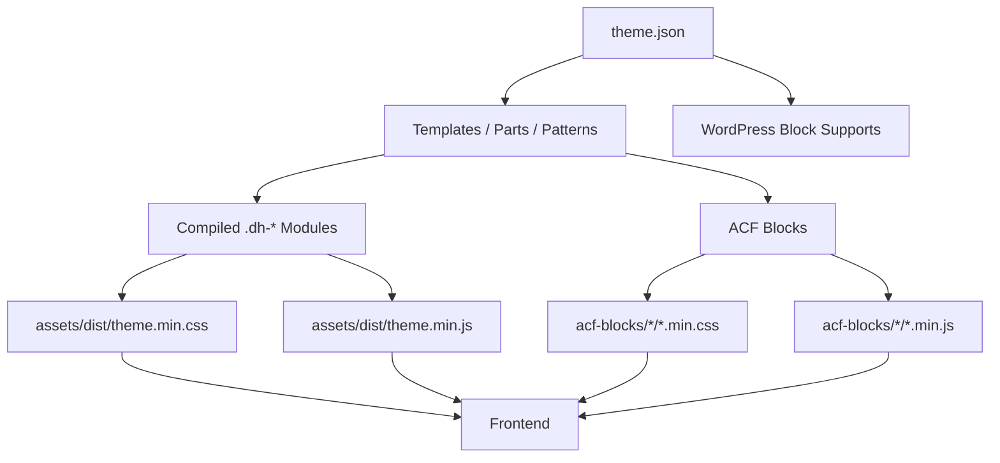
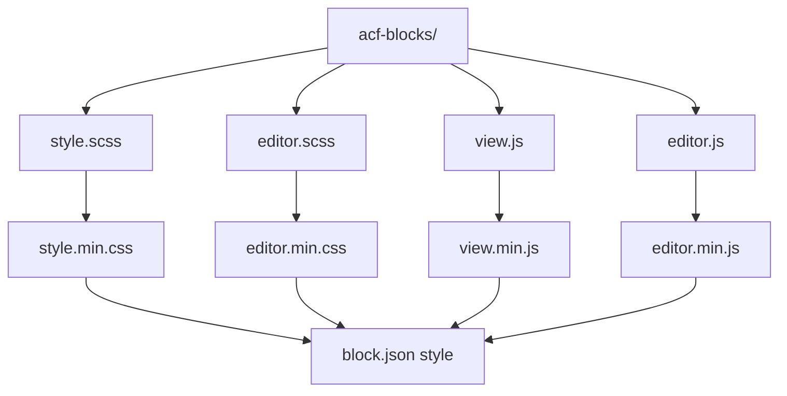
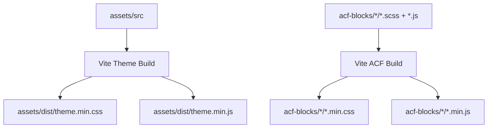

# BlockWind Architecture

This document describes the structural, styling, and build architecture of the BlockWind theme.

---

## Core design principle

> **`theme.json` is the single source of truth for design tokens.**

Everything else consumes those tokens rather than redefining them.

---

## High-level architecture

---

## ACF block architecture

---

## Build system architecture

