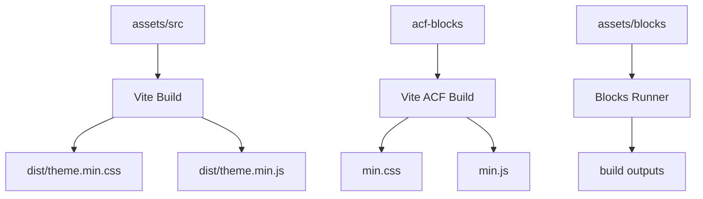

# Build System

```mermaid
flowchart TD
    A[assets/src] --> B[Vite Build]
    B --> C[dist/theme.min.css]
    B --> D[dist/theme.min.js]

    E[acf-blocks] --> F[Vite ACF Build]
    F --> G[min.css]
    F --> H[min.js]

    I[assets/blocks] --> J[Blocks Runner]
    J --> K[build outputs]
```
