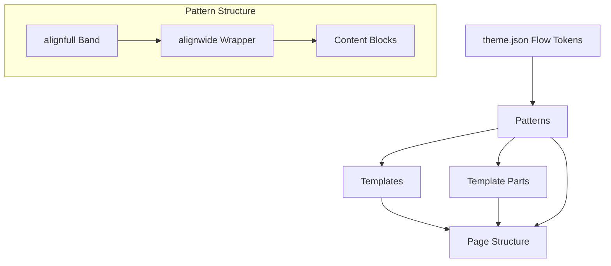

# Layout System

BlockWind uses a **sections-first composition model**.

## Layout ownership diagram

## Principles
- Templates are neutral
- Patterns own spacing and gutters
- Template parts behave like persistent sections
- Flow tokens drive layout rhythm
