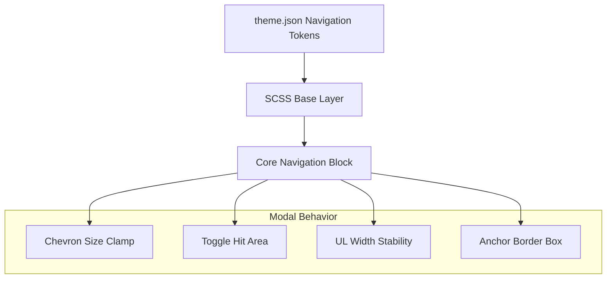

# Navigation Baseline

## Navigation ownership diagram

```mermaid
flowchart TD
    A[theme.json Navigation Tokens] --> B[SCSS Base Layer]
    B --> C[Core Navigation Block]

    subgraph Modal Behavior
        M1[Chevron Size Clamp]
        M2[Toggle Hit Area]
        M3[UL Width Stability]
        M4[Anchor Border Box]
    end

    C --> M1
    C --> M2
    C --> M3
    C --> M4
```

## Guarantees
- Chevron icon constant size
- Toggle hit area stable
- No horizontal shift in modal
- Anchors use border-box sizing
